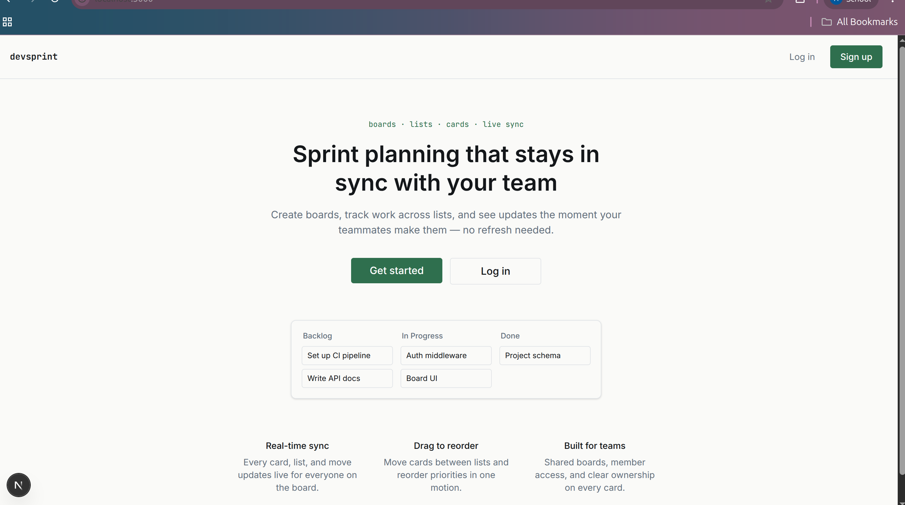
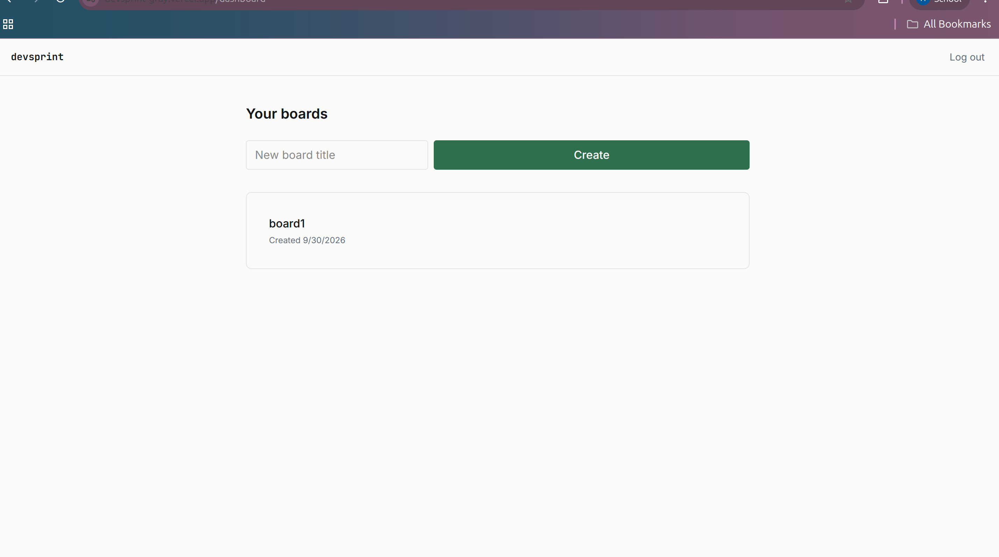
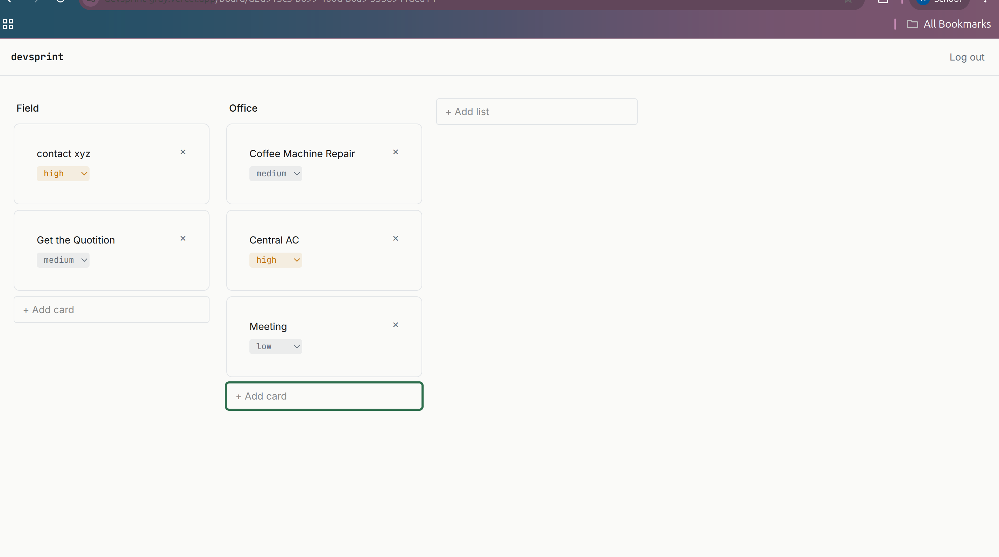
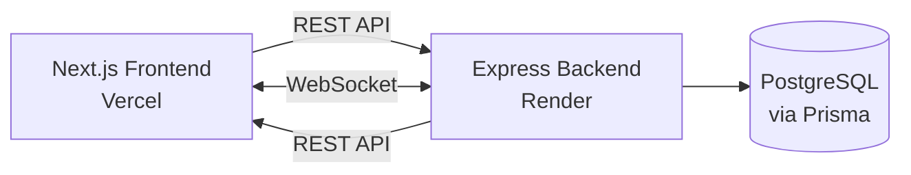

# DevSprint

A real-time sprint planning tool for dev teams — create boards, organize work across lists, and see every change sync live across everyone viewing the board.

**Live app:** https://devsprint-gray.vercel.app
**API:** https://devsprint-api.onrender.com

Built by Ayush Kumar Singh — [GitHub](https://github.com/AyushKrSingh01)

> Note: the backend is on Render's free tier, which spins down after inactivity — the first request after a while may take up to 50 seconds to respond while it wakes up.

## Screenshots

| Landing page | Dashboard | Board view |
|---|---|---|
|  |  |  |

## What it does

- Sign up / log in with JWT-based authentication
- Create boards, add lists (e.g. Backlog, In Progress, Done), add cards with priority levels
- Drag and drop cards to reorder them or move them between lists
- Every change — new cards, priority updates, deletions, reordering — syncs live to every other tab or user viewing the same board, no refresh needed

## Tech stack

**Frontend:** Next.js (App Router), TypeScript, Tailwind CSS, Socket.io-client, @dnd-kit
**Backend:** Node.js, Express, TypeScript, Socket.io, PostgreSQL, Prisma ORM
**Auth:** JWT, bcrypt
**Deployment:** Vercel (frontend), Render (backend + PostgreSQL)

## Why these choices

- **PostgreSQL over MongoDB** — the data is genuinely relational: a board has many lists, a list has many cards, users can belong to many boards. Modeling this in SQL with real foreign keys is more natural than nesting or manually managing references in a document store.
- **JWT auth, stateless** — no server-side session storage; every protected route verifies the token's signature rather than checking a database.
- **WebSockets (Socket.io) for real-time sync** — REST alone can't push updates to clients; the server needs to actively notify everyone viewing a board when something changes. Socket.io's "rooms" feature scopes broadcasts to just the board being viewed, rather than every connected client.
- **Authorization checks on every resource, not just authentication** — every board/list/card route verifies the requesting user actually owns or is a member of the resource before returning or modifying it. Skipping this would let any logged-in user access or modify data belonging to someone else, just by guessing an ID (a real vulnerability class called broken object-level authorization).

## Architecture



## A technical challenge worth mentioning

This project uses Prisma 7, which turned out to be very recent — recent enough that several of its defaults (the new `prisma-client` generator output structure, a required database driver adapter instead of Prisma handling connections internally, a `prisma.config.ts` file replacing implicit `.env` loading) differed from most existing tutorials and documentation. Working through these breaking changes — including an ESM/CommonJS module conflict traced back to import ordering with `dotenv` — involved reading release notes and debugging unfamiliar territory rather than following a known path.

## Running locally

**Backend:**
```bash
cd server
npm install
# Set up .env with DATABASE_URL and JWT_SECRET
npx prisma migrate dev
npm run dev
```

**Frontend:**
```bash
cd client
npm install
# Set up .env.local with NEXT_PUBLIC_API_URL
npm run dev
```

## Known limitations / what I'd improve next

- JWT is stored in `localStorage`, not an httpOnly cookie — simpler to implement but more vulnerable to XSS than a cookie-based approach would be
- No automated tests yet
- No rate limiting on the API
- Card `position` updates during drag-and-drop don't roll back on API failure — a rare edge case, but worth handling properly
- No dark mode (deliberately deferred to keep the first pass focused)

## Project structure

```text
devsprint/
  client/            Next.js frontend
    src/app/         App Router pages
    src/components/  Shared design-system components
    src/lib/         API client, socket client
  server/            Express backend
    src/routes/      boards, lists, cards, auth
    src/middleware/  JWT verification
    src/lib/         Prisma client
```
